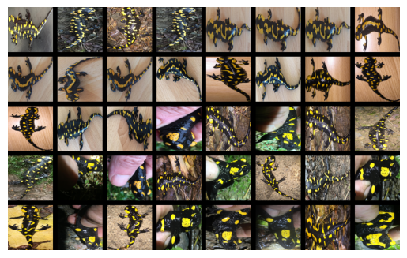

<!-- ⚠️ WARNING: This output md file is auto-generated from a template file. 
     Do NOT edit this file directly to avoid losing information \
     when the file is regenerated from the template.
     Instead, edit the template or the source markdown. -->

# 🦓🦒 Great Zebra & Giraffe Count and ID

[](https://lila.science/datasets/great-zebra-giraffe-id)
[](https://lila.science/datasets/great-zebra-giraffe-id)
[](https://www.iucnredlist.org/species/41013/45172424)[](https://www.iucnredlist.org/species/88421036/88421121)
[](../licenses/cdla-permissive.md)
[](https://lila.science/datasets/great-zebra-giraffe-id)
[]( "This dataset is from March 2015")
[]( "ReIDHub Unique Dataset Identifier")


<p align="center">
  
</p>

---

## 📄 Overview
This dataset contains images taken from a two-day photographic census of **Plains zebra** and **Masai giraffe** at **Nairobi National Park, Kenya** in 2015.   

It includes individual IDs for both species, with bounding boxes, metadata such as viewpoint, species, ID; and resized images (≤3000 px).  

The IDs were assigned using the HotSpotter algorithm, [Crall et al. 2013](https://ieeexplore.ieee.org/abstract/document/6475023) by visually matching the stripes and spots as seen on the body of the animal.

---

## ⚠️ Usage Notes


- Highly **imbalanced**: many individuals seen only once.  
- Metadata includes viewpoint; useful for studying orientation effects in ReID.  
- All images are in the `train` split; custom validation/test splits needed.  


---
## 🧩 Enrichments

<p align="center">
  
</p>

---

## 📥 Access
Original Source: [LILA](https://lila.science/datasets/great-zebra-giraffe-id)  
Enriched Version: [Hugging Face]( "TODO: The HF mirror link coming soon")  

### a. Provenance

To access the raw dataset from source, run the following:

```python
from reidhub.access.provenance.gzgc import download_and_extract
dataset_root = download_and_extract()
print(f'Dataset downloaded to: {dataset_root}')
```

### b. Enriched Re-Access

To access the processed, refined and enriched dataset from public mirrors, run the following:

<p align="center">
  
</p>

---

## 📜 Citation 

<!--
BIBTEX: 
@inproceedings{parham2017animal,
  title={Animal population censusing at scale with citizen science and photographic identification},
  author={Parham, Jason and Crall, Jonathan and Stewart, Charles and Berger-Wolf, Tanya and Rubenstein, Daniel I},
  booktitle={AAAI spring symposium-technical report},
  year={2017}
}
-->

> Parham, J., Crall, J., Stewart, C., Berger-Wolf, T., Rubenstein, D.I.  
> *Animal population censusing at scale with citizen science and photographic identification.* AAAI Spring Symposium, 2017. [https://cdn.aaai.org/ocs/15245/15245-68194-1-PB.pdf](https://cdn.aaai.org/ocs/15245/15245-68194-1-PB.pdf)


```bibtex
@inproceedings{parham2017animal,
  title={Animal population censusing at scale with citizen science and photographic identification},
  author={Parham, Jason and Crall, Jonathan and Stewart, Charles and Berger-Wolf, Tanya and Rubenstein, Daniel I},
  booktitle={AAAI spring symposium-technical report},
  year={2017}
}
```

---

## 📚 Publications 

<p align="center">
  
</p>

---
## 🎯 Potential Usecases

- **Re-ID / Retrieval** under class imbalance  
- **Few-shot learning**: many IDs with 1 image only  
- **Viewpoint analysis** for stripes and spot patterns  
- Combine with other zebra/giraffe datasets for **cross-dataset generalization**  

---